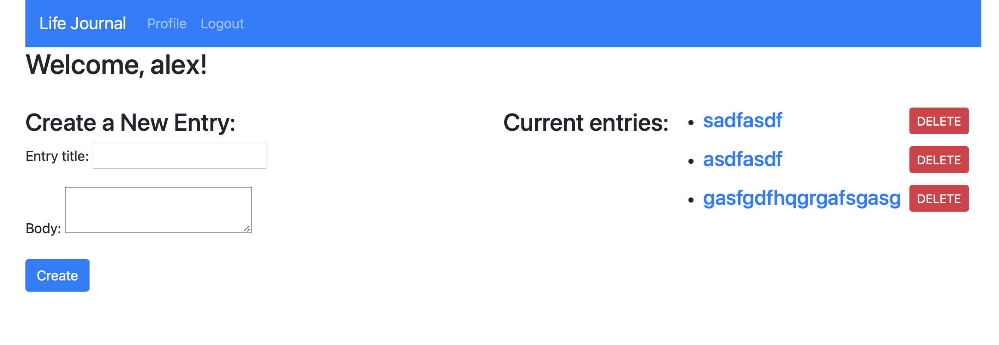

# Life-Journal

## Table of Contents
[Description](#description)  
[Installation](#Installation)  
[Test](#Testing)  
[Project Links](#live-Site-and-Repo)  
[License](#License)  
[Contributors](#Contributors)  

## Description
* This is a blog site that allows users to login and create blog posts. all posts are displayed on the home page. when logged in the user can create and delete posts. 

## Installation
* npm i
* npm start
* in browser go to htts://localhost:3001

## Testing
* No testing available

## Live Site and Repo
* [live Site](https://github.com/ajlaursen/life-journal)
* [Repo](https://life-journal-ajl.herokuapp.com/)

## License
* 

## Contributors
* Contributor: [Alex Laursen](https://github.com/ajlaursen) Email: [contact@ajlaursen.codes](mailto:contact@ajlaursen.codes)

## Demo
